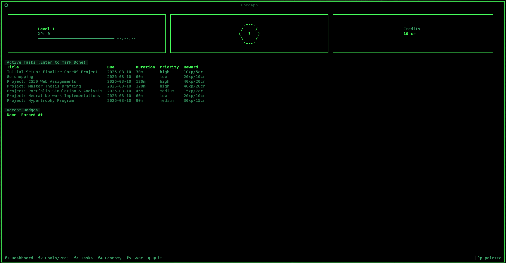
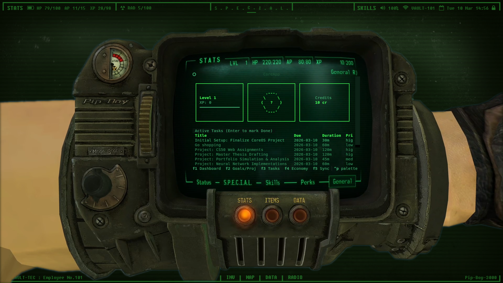

# CoreOS: Personal Self-Development CLI

CoreOS is a terminal-based productivity and life management system designed for personal use. It helps you track goals, projects, tasks, habits, and manage your personal economy through XP and credits.

## Features

*   **Goal Tracking**: Define long-term aspirations and track progress.
*   **Project Management**: Break down goals into actionable projects.
*   **Task Management**: Create and manage daily tasks with priorities and deadlines.
*   **Habit Tracking**: Build good habits and break bad ones with rewards and costs.
*   **Economy System**: Earn XP and Credits for completing tasks and habits, spend credits on bad habits.
*   **TUI Interface**: Navigate and manage your life through an intuitive Textual-based terminal UI.
*   **Customizable Themes**: Easily adjust the look and feel via `theme.py`.

## Demo 

*   It's transparency theme with Kitty Terminal

## Prerequisites

*   **Python 3**: Ensure you have Python 3 installed on your system.
*   **Textual**: The TUI is built with Textual. It will be installed as a dependency.
*   **Terminal Emulator**: A terminal emulator with good transparency support is recommended for the best visual experience. **Kitty** is confirmed to work well, while Alacritty may have transparency issues.

## Setup Instructions (Linux)

Follow these steps to get CoreOS up and running on your Linux machine:

### 1. Clone the Repository

First, clone the project repository to your local machine:

```bash
git clone https://github.com/Tong-ST/CoreOS.git
cd CoreOS
```

### 2. Create and Activate Virtual Environment

It's highly recommended to use a Python virtual environment to manage dependencies for this project.

```bash
# Create a virtual environment (named 'venv' in the project root)
python3 -m venv venv

# Activate the virtual environment
source venv/bin/activate
```

### 3. Install Dependencies

Install the project's dependencies using pip:

```bash
pip install -r requirements.txt
```

### 4. Make the App Executable

To easily launch CoreOS from anywhere in your terminal, you can create a simple executable script.

**Create the script file:**

```bash
nano ~/.local/bin/coreos
```

**Paste the following logic into the file:**

```bash
#!/bin/bash
# Point directly to the venv's python to run the script
# Replace the path with your actual project path if it's not ~/Documents/GitHub/CoreOS
~/Documents/GitHub/CoreOS/venv/bin/python ~/Documents/GitHub/CoreOS/main.py "$@"
```

**Make the script executable:**

```bash
chmod +x ~/.local/bin/coreos
```

**Note:** If `~/.local/bin` is not in your system's PATH, you may need to add it. You can typically do this by editing your shell's configuration file (e.g., `~/.zshrc` or `~/.bashrc`) and adding `export PATH="$HOME/.local/bin:$PATH"`, then sourcing the file or restarting your shell.

### 5. Update Sway Configuration (If using Sway WM)

If you use the Sway window manager, you can bind `coreos` to a keyboard shortcut for easy launching. Add the following line to your Sway configuration file (usually `~/.config/sway/config`):

```code
bindsym $mod+Shift+m exec kitty -e coreos
```
*(This example binds it to `Super + Shift + m` and uses `foot` as the terminal. Adjust `kitty -e` and the keybind as needed for your setup.)*

## How to Use

Once set up, you can launch the application by simply typing `coreos` in your terminal.

### CLI Commands

Interact with CoreOS using various commands:

*   **Goals**:
    *   `coreos goal add <title> <description> <badge_name> <badge_description> [--due YYYY-MM-DD]`
    *   `coreos goal edit <id> [--title <...> ] [--description <...>] ... [--due YYYY-MM-DD]`
    *   `coreos goal delete <id>`
    *   `coreos goal list`
    *   `coreos goal done <id>`
    *   `coreos goal undo <id>`
*   **Projects**:
    *   `coreos project add <title> <description> [--goal <goal_id>] [--duration <mins>] [--due YYYY-MM-DD] [--priority <high|medium|low>]`
    *   `coreos project edit <id> ... [--priority <...>]`
    *   `coreos project delete <id>`
    *   `coreos project list`
    *   `coreos project done <id>`
    *   `coreos project undo <id>`
*   **Tasks**:
    *   `coreos task add <title> [--project <project_id>] [--due YYYY-MM-DD] [--priority <high|medium|low>] [--duration <mins>]`
    *   `coreos task edit <id> ...`
    *   `coreos task delete <id>`
    *   `coreos task list`
    *   `coreos task done <id>`
    *   `coreos task undo <id>`
*   **Habits**:
    *   `coreos habit add <title> <credit_reward>`
    *   `coreos habit edit <id> ...`
    *   `coreos habit delete <id>`
    *   `coreos habit log <id>`
*   **Bad Habits**:
    *   `coreos badhabit add <title> <credit_cost>`
    *   `coreos badhabit edit <id> ...`
    *   `coreos badhabit delete <id>`
    *   `coreos badhabit spend <id>`
*   **Economy**:
    *   `coreos badge` (Lists earned badges)
    *   `coreos balance` (Shows XP and Credits)

### TUI Navigation

*   **Switch Screens**: Use `F1` (Dashboard), `F2` (Goals/Proj), `F3` (Tasks), `F4` (Economy).
*   **Add New**: `g` (Goal), `p` (Project), `n` (Task), `h` (Good Habit), `b` (Bad Habit).
*   **Edit**: `e` (on selected item).
*   **Delete**: `x` (on selected item).
*   **Mark Done**: `Enter` or `d`.
*   **Undo**: `u` (on selected item).
*   **Sync/Refresh**: `F5`.
*   **Quit**: `q`.

## Terminal Notes

*   Transparency works best with terminal emulators like **Kitty**.
*   Alacritty may exhibit transparency issues with this TUI.

## With my others app ([Funcher](https://github.com/Tong-ST/Funcher))

